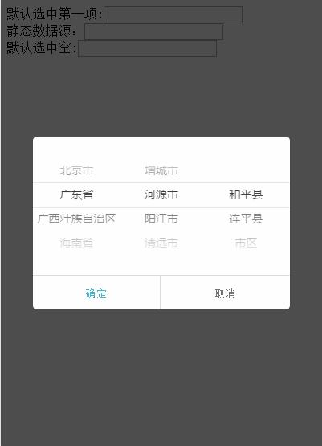

# mobile-select-area
手机联动选择地区
效果图如下：

例子见[DEMO](http://www.lovewebgames.com/jsmodule/mobile-select-area.html)  

#用法
	node http.js

或者

	打开start.bat

##注：依赖于[dialog](https://github.com/tianxiangbing/dialog)

	<!DOCTYPE>
	<html>
		<head>
			<title>选择日期</title>
			<meta name="viewport" content="width=device-width, initial-scale=1.0, maximum-scale=1.0, user-scalable=0">
			<link rel="stylesheet" type="text/css" href="../dist/mobile-select-area.css">
			<link rel="stylesheet" type="text/css" href="../dist/dialog.min.css">
			
			
			
			
		</head>
		<body>
			<input type="text" id="txt_area" value="浙江省 杭州市 滨江区"/>
			<input type="hidden" id="hd_area" value="1,1,1"/>
			
		</body>
	</html>
#属性及方法
##default:`0||1`
	0为空,true时默认选中第一项,默认1
##trigger:
	触发弹窗的DOM元素 ，可以是input或其他
##value:
	初始值,
#level: `int`
	级别数，默认是3级的
#separator: `,`
	id值分隔符
#eventName:`tap|click`
	触发事件名称，默认click,使用zeptojs的可以用tap事件
##data:
	当data为json对象时可以直接解析,此时直接接收数组
	当data为string发送ajax请求后返回json,格式如下：
	{
		"data": [{
			"id": 1,
			"name": "浙江省",
			"child": [{
				"id": "1",
				"name": "杭州市",
				"child": [{
					"id": 1,
					"name": "滨江区"
				}]
			}]
		}, {
			"id": 2,
			"name": "江苏省",
			"child": [{
				"id": "1",
				"name": "南京",
				"child": [{
					"id": 1,
					"name": "解放区"
				}]
			}]
		}, {
			"id": 3,
			"name": "湖北省"
		}]
	}
#callback:function(scroller,text,value)
	第一个是容器，第二个是选中后的text值，第三个参数是选中后的id。
	并且this指向当前对象。
	选中后的回调，默认有填充trigger的value值，以及赋值它后面紧跟着的hidden的value值，以逗号分隔id，空格分隔文字

*1.7之后不再推荐使用zepto，请尽量使用jquery吧*